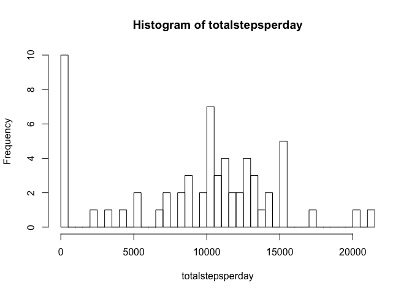
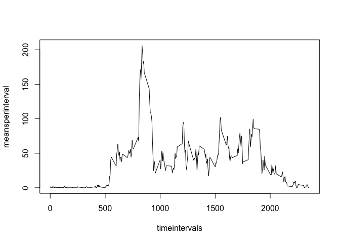
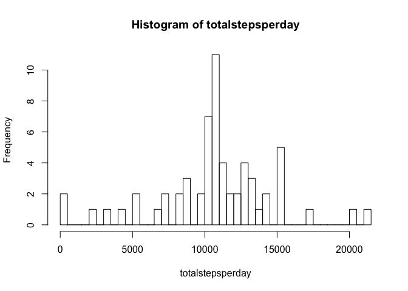
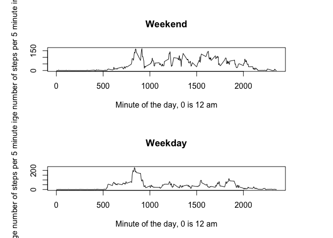

# PA1_template

## Loading and preprocessing the data

```r
stepdf = read.csv("activity.csv")
```

## What is mean total number of steps taken per day?

```r
totalstepsperday = tapply(stepdf$steps, stepdf$date, sum, na.rm = T)
hist(totalstepsperday, breaks = 61)
```

<!-- -->

```r
mean(totalstepsperday)
```

```
## [1] 9354.23
```

```r
median(totalstepsperday)
```

```
## [1] 10395
```

## What is the average daily activity pattern?

```r
timeintervals = unique(stepdf$interval)
meansperinterval = sapply(timeintervals, 
              function(x) mean(stepdf$steps[stepdf$interval == x], na.rm = T))
plot(timeintervals, meansperinterval, type = "l")
```

<!-- -->

```r
#most active time interval:
timeintervals[which(meansperinterval == max(meansperinterval))]
```

```
## [1] 835
```


## Imputing missing values with interval means

```r
sum(is.na(stepdf$steps))
```

```
## [1] 2304
```

```r
naintervals = stepdf$interval[is.na(stepdf$steps)]
imputedsteps = sapply(naintervals, function(x) meansperinterval[which(timeintervals == x)])
stepdf$steps[is.na(stepdf$steps)] = imputedsteps
#stepdf$interval

totalstepsperday = tapply(stepdf$steps, stepdf$date, sum, na.rm = T)
hist(totalstepsperday, breaks = 61)
```

<!-- -->

## Are there differences in activity patterns between weekdays and weekends?

```r
weekday = weekdays(as.POSIXct(stepdf$date))
weekendweekday = sapply(weekday, function(x) if(x=="Saturday" | x=="Sunday"){"weekend"}else{"weekday"})
weekendweekday = as.factor(unname(weekendweekday))
summary(weekendweekday)
```

```
## weekday weekend 
##   12960    4608
```

```r
stepdf$weekpart = weekendweekday

timeintervals = unique(stepdf$interval)


wemeansperinterval = sapply(timeintervals, 
                            function(x) mean(stepdf$steps[stepdf$interval == x & stepdf$weekpart == "weekend"], na.rm = T))
wdmeansperinterval = sapply(timeintervals, 
                            function(x) mean(stepdf$steps[stepdf$interval == x & stepdf$weekpart == "weekday"], na.rm = T))

par(mfcol = c(2,1), mar = rep(5,4))
plot(timeintervals, wemeansperinterval, type = "l", main = "Weekend", xlab = "Minute of the day, 0 is 12 am", ylab = "Average number of steps per 5 minute interval")
plot(timeintervals, wdmeansperinterval, type = "l", main = "Weekday", xlab = "Minute of the day, 0 is 12 am", ylab = "Average number of steps per 5 minute interval")
```

<!-- -->


